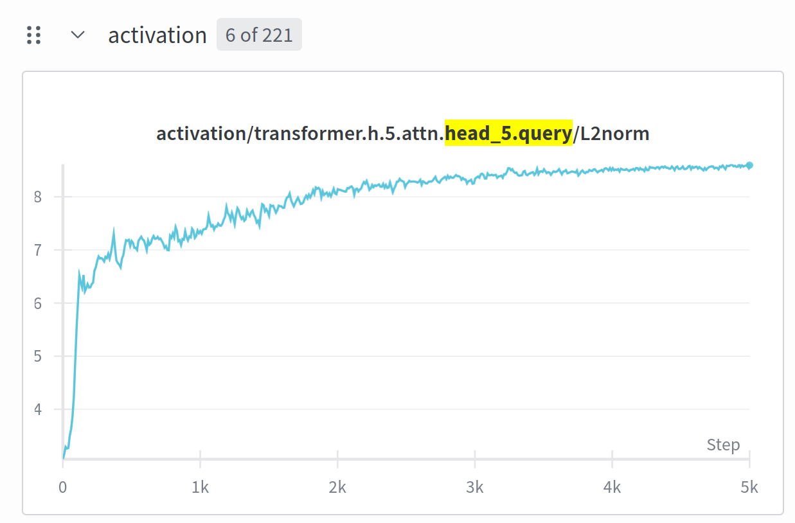
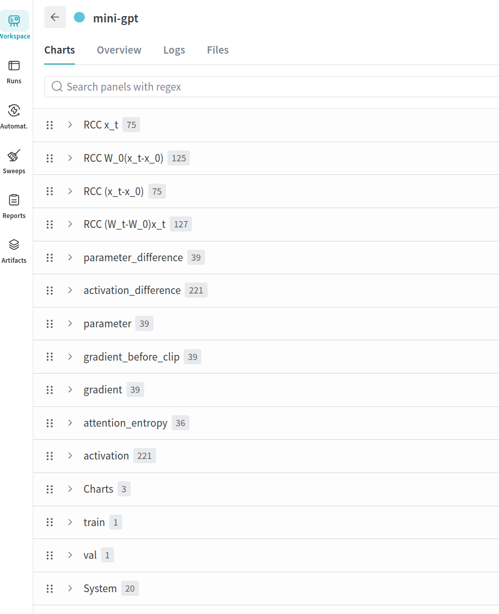

# Monitor the training of your PyTorch modules



[](https://www.python.org/downloads/)
[](https://opensource.org/licenses/MIT)

This is a research codebase to monitor the training dynamics of small-to-medium neural networks. Log arbitrary metrics of activations, gradients, and parameters to Weights & Biases with a few lines of code!

We also provide an implementation of the refined coordinate check (RCC) from the NeurIPS 2025 paper ["On the Surprising Effectiveness of Large Learning Rates under Standard Width Scaling"](https://arxiv.org/abs/2505.22491) (Haas et al., 2025).

⚡For a complete working example, see how the monitor can be integrated into [nanoGPT](https://github.com/tml-tuebingen/nanoGPT-monitored).⚡


### Installation

```bash
pip install torch-module-monitor
```

---

## Features

**1. Monitor arbitrary metrics of activations, gradients, and parameters with a few lines of code**
- Add new metrics for activations, gradients, and parameters with a single line of code.
- Regex-based filtering to determine what should be logged
- Monitor the internals of the attention operation (query/key/value tensor metrics, attention entropy)
- Aggregation of activation metrics across micro-batches

**2. Perform the Refined Coordinate Check (RCC) from https://arxiv.org/abs/2505.22491**
- We provide an implementation of the refined coordinate check.

---

## Basic Usage

```python
from torch_module_monitor import ModuleMonitor

# Initialize and add metrics
monitor = ModuleMonitor(monitor_step_fn=lambda step: step % 10 == 0)
monitor.set_module(model)

monitor.add_activation_metric("mean", lambda x: x.mean(dim=-1))
monitor.add_parameter_metric("norm", lambda x: x.norm())
monitor.add_gradient_metric("norm", lambda x: x.norm())

# Training loop
for step, (inputs, targets) in enumerate(dataloader):
    monitor.begin_step(step)

    outputs = model(inputs)  # Activations captured via hooks
    loss = criterion(outputs, targets)
    loss.backward()

    monitor.monitor_parameters()
    monitor.monitor_gradients()

    optimizer.step()
    optimizer.zero_grad()
    monitor.end_step()

    # Log metrics
    if monitor.is_step_monitored(step):
        wandb.log(monitor.get_step_metrics())
```

## Complete Examples

**See [examples/](examples/) for complete examples:**
- `metrics.ipynb` - Basic metric monitoring
- `reference-model.ipynb` - Reference module comparison
- `refined-coordinate-check.ipynb` - Refined coordinate check

⚡We also show how to integrate the monitor into [nanoGPT](https://github.com/tml-tuebingen/nanoGPT-monitored).⚡


---

## Integration with Weights & Biases

We name the different metrics such that they are nicely visualized in Weights & Biases.

Log the collected metrics in a single line of code:

```python
wandb.log(training_monitor.get_step_metrics(), step=current_step)
```

[Link to wandb logs of nanoGPT run](https://wandb.ai/public-runs/shakespeare-char/runs/943n8dnt)



---

## Patterns

### Monitor Activations

Add metrics to monitor module activations during the forward pass:

```python
monitor.add_activation_metric(
    metric_name: str,
    metric_fn: Callable[[torch.Tensor], torch.Tensor | scalar],
    metric_regex: str = ".*",
    metric_aggregation_fn: Optional[Callable] = None
)
```

**Metric Function Signature:**
- **Input**: Activation tensor from a module's forward pass, received by a forward hook on the module.
- **Output**: Can be either a tensor or a scalar. Tensors are flattened and aggregated across the batch/sequence dimensions.

**Example - Basic metrics:**
```python
# Compute L2 norm across the last dimension
monitor.add_activation_metric("l2norm", lambda x: x.norm(dim=-1))

# Compute mean activation
monitor.add_activation_metric("mean", lambda x: x.mean(dim=-1))
```

**Aggregation Across Micro-Batches:**

When training with gradient accumulation, activation metrics are logged for each micro-batch and then aggregated at `end_step()`. By default, aggregation uses the mean.

You can specify custom aggregation functions:

```python
# Track minimum activation across micro-batches for conv1 modules
monitor.add_activation_metric(
    "min",
    lambda x: torch.min(x, dim=-1).values,
    metric_regex="conv1",
    metric_aggregation_fn=torch.min  # Custom aggregation
)

# Track maximum activation across micro-batches for conv2 modules
monitor.add_activation_metric(
    "max",
    lambda x: torch.max(x, dim=-1).values,
    metric_regex="conv2",
    metric_aggregation_fn=torch.max  # Custom aggregation
)
```

The aggregation function receives a concatenated tensor of all values from micro-batches and should return a scalar.

### Monitor Parameters

Add metrics to monitor model parameters:

```python
monitor.add_parameter_metric(
    metric_name: str,
    metric_fn: Callable[[torch.Tensor], scalar],
    metric_regex: str = ".*"
)
```

**Metric Function Signature:**
- **Input**: Parameter tensor
- **Output**: Scalar value

**Example:**
```python
# L2 norm of parameters
monitor.add_parameter_metric("l2norm", lambda p: p.norm())

# Maximum absolute value
monitor.add_parameter_metric("max", lambda p: p.abs().max())

# Operator norm for fully connected layers
monitor.add_parameter_metric(
    "opnorm",
    lambda p: torch.linalg.matrix_norm(p, ord=2),
    metric_regex=r"fc\d*\.weight"
)
```

The metrics are computed when you call `monitor.monitor_parameters()` in your training loop.

### Monitor Gradients

Add metrics to monitor parameter gradients:

```python
monitor.add_gradient_metric(
    metric_name: str,
    metric_fn: Callable[[torch.Tensor], scalar],
    metric_regex: str = ".*"
)
```

**Metric Function Signature:**
- **Input**: Gradient tensor
- **Output**: Scalar value

**Example:**
```python
# L2 norm of gradients
monitor.add_gradient_metric("l2norm", lambda g: g.norm())

# Maximum absolute gradient
monitor.add_gradient_metric("max", lambda g: g.abs().max())
```

The metrics are computed when you call `monitor.monitor_gradients()` in your training loop.

**Gradient Clipping:**

We provide a simple utility to monitor gradients both before and after clipping:

```python
# In your training loop
loss.backward()

# Monitor gradients before clipping
monitor.monitor_gradients(before_clip=True)

# Clip gradients
torch.nn.utils.clip_grad_norm_(model.parameters(), max_norm=1.0)

# Monitor gradients after clipping
monitor.monitor_gradients(before_clip=False)
```

When `before_clip=True`, metrics are logged as `gradient_before_clip/{param}/{metric}` instead of `gradient/{param}/{metric}`.

### Regex-Based Module Filtering

You can use a regex to specify that a metric should only be computed for specific tensors.

```python
# Monitor only MLP layers
monitor.add_activation_metric(
    "my_metric", lambda x: x.mean(), metric_regex=r".*mlp.*"
)

# Monitor only convolutional layers
monitor.add_parameter_metric(
    "weight_norm", lambda p: p.norm(), metric_regex=r"conv\d+\.weight"
)
```

### Reference Module Comparison

In infinite width theory, we often want to measure the difference of activations and parameters to the model at initialization. We implement this via an arbitrary reference model to which our model can be compared.

**Setup:**

```python
# Set the reference module (e.g., model at initialization)
monitor.set_reference_module(reference_model)
```

**Training Loop Integration:**

The reference module must perform a forward pass **before** the monitored module to store reference activations:

```python
for step, (inputs, targets) in enumerate(dataloader):
    monitor.begin_step(step)

    # Reference model forward pass (with no_grad)
    # This stores reference activations for comparison
    with torch.no_grad():
        reference_outputs = reference_model(inputs)

    # Monitored model forward pass
    # Hooks automatically compute difference metrics using stored reference activations
    outputs = model(inputs)
    loss = criterion(outputs, targets)
    loss.backward()

    monitor.monitor_parameters()
    monitor.monitor_gradients()

    optimizer.step()
    optimizer.zero_grad()
    monitor.end_step()
```

#### Monitor Activation Differences

Track how activations differ from the reference module:

```python
monitor.add_activation_difference_metric(
    metric_name: str,
    metric_fn: Callable[[torch.Tensor, torch.Tensor], torch.Tensor | scalar],
    metric_regex: str = ".*",
    metric_aggregation_fn: Optional[Callable] = None
)
```

**Metric Function Signature:**
- **Input**: Two tensors - `(activations, reference_activations)`
- **Output**: Tensor or scalar representing the difference
- Aggregation across micro-batches works the same as for activation metrics

**Example:**

```python
# L2 distance between activations and reference
monitor.add_activation_difference_metric(
    "l2norm",
    lambda act, ref_act: torch.linalg.vector_norm(act - ref_act, ord=2, dim=-1)
)

# Relative change in activations
monitor.add_activation_difference_metric(
    "relative_change",
    lambda act, ref_act: (act - ref_act).norm() / (ref_act.norm() + 1e-8)
)
```

These metrics are automatically computed during the forward pass when reference activations are available. They are logged as `activation_difference/{module}/{metric}`.

#### Monitor Parameter Differences

Track how parameters differ from the reference module:

```python
monitor.add_parameter_difference_metric(
    metric_name: str,
    metric_fn: Callable[[torch.Tensor, torch.Tensor], scalar],
    metric_regex: str = ".*"
)
```

**Metric Function Signature:**
- **Input**: Two tensors - `(parameter, reference_parameter)`
- **Output**: Scalar value representing the difference

**Example:**

```python
# L2 distance from initialization
monitor.add_parameter_difference_metric(
    "l2_distance",
    lambda p, p_ref: (p - p_ref).norm()
)

# Cosine similarity with initialization
monitor.add_parameter_difference_metric(
    "cosine_similarity",
    lambda p, p_ref: torch.nn.functional.cosine_similarity(
        p.flatten(), p_ref.flatten(), dim=0
    )
)
```

Call `monitor.monitor_parameters()` to compute these metrics. They are logged as `parameter_difference/{param}/{metric}`.

### Refined Coordinate Check

The Refined Coordinate Check (RCC) from [Haas et al., 2025](https://arxiv.org/abs/2505.22491) is an advanced diagnostic that builds on **Reference Module Comparison** (see above). While activation difference metrics compute simple differences like `||act - ref_act||`, RCC decomposes these changes into two components:

- **(W_t - W_0) x_t**: Change due to weight updates (learning)
- **W_0 (x_t - x_0)**: Change due to input changes (drift)

This helps diagnose whether model changes are driven by weight learning or input drift across layers.

**Setup:**

```python
from torch_module_monitor import ModuleMonitor, RefinedCoordinateCheck

# Initialize monitor with a reference module (see Reference Module Comparison)
monitor = ModuleMonitor(monitor_step_fn=lambda step: step % 100 == 0)
monitor.set_module(model)
monitor.set_reference_module(reference_model)

# Initialize the RCC
coordinate_check = RefinedCoordinateCheck(monitor)
```

**Training Loop Integration:**

The training loop is similar to the reference module comparison workflow, with one addition:

```python
for step, (inputs, targets) in enumerate(dataloader):
    monitor.begin_step(step)

    # Reference model forward pass (required - same as reference module comparison)
    # This stores reference activations (W_0 x_0)
    with torch.no_grad():
        reference_outputs = reference_model(inputs)

    # Monitored model forward pass
    # This stores current activations (W_t x_t) and inputs (x_t)
    outputs = model(inputs)
    loss = criterion(outputs, targets)
    loss.backward()

    # Perform RCC - this does additional forward passes to compute W_0(x_t)
    coordinate_check.refined_coordinate_check()

    monitor.monitor_parameters()
    monitor.monitor_gradients()

    optimizer.step()
    optimizer.zero_grad()
    monitor.end_step()
```

**How RCC Works:**

1. **Reference forward pass**: Stores W_0 x_0 (reference activations) and x_0 (reference inputs)
2. **Monitored forward pass**: Stores W_t x_t (current activations) and x_t (current inputs)
3. **RCC computation**: Performs **additional forward passes** with the reference module using current inputs to compute W_0(x_t)
4. **Decomposition**: Computes both components:
   - `(W_t - W_0) x_t = W_t x_t - W_0 x_t`
   - `W_0 (x_t - x_0) = W_0 x_t - W_0 x_0`

**Important Notes:**

1. **Builds on Reference Module**: RCC requires the same setup as reference module comparison. The reference forward pass stores the activations that RCC uses.

2. **Additional Forward Passes**: The `refined_coordinate_check()` method performs **extra forward passes** internally to compute W_0(x_t). These are done with `torch.no_grad()`, but be aware of the computational cost (~2x forward passes per step).

3. **Logged Metrics**: RCC logs metrics under these prefixes:
   - `RCC (W_t-W_0)x_t/{module}/l2norm` - Change due to weight updates
   - `RCC W_0(x_t-x_0)/{module}/l2norm` - Change due to input changes
   - `RCC x_t/{module}/l2norm` - Current input norm
   - `RCC (x_t-x_0)/{module}/l2norm` - Input change norm

For Linear and LayerNorm layers, additional bias-free metrics are logged separately for weights (e.g., `{module}.weight/l2norm`).

## Complex Modules

By default, we monitor the activations of modules that return a single tensor. To monitor statistics of complex modules, these modules can implement `MonitorMixin`. We use this approach to monitor the internals of the attention operation. 

```python
from torch_module_monitor import MonitorMixin, monitor_scaled_dot_product_attention

class MultiHeadAttention(nn.Module, MonitorMixin):
    def forward(self, x):
        q, k, v = self.compute_qkv(x)
        attn_output = F.scaled_dot_product_attention(q, k, v)

        if self.is_monitoring:
            monitor_scaled_dot_product_attention(
                self.get_module_monitor(), module=self,
                query=q, key=k, value=v, activation=attn_output
            )

        return self.output_projection(attn_output)
```

This logs per-head metrics: `activation/{module}.head_{i}.query`, `attention_entropy/{module}.head_{i}`, etc.

**Custom metrics in any module:**

```python
from torch_module_monitor import MonitorMixin

class CustomLayer(nn.Module, MonitorMixin):
    def forward(self, x):
        output = self.transform(x)

        if self.is_monitoring:
            self.get_module_monitor().log_tensor("custom_stat", output.norm(dim=-1))

        return output
```

## Multi-GPU Support

In principle, the monitor can support multi-GPU training, though we do not provide direct support for any parallelization strategy. With FSDP, for example, every GPU could have its own monitor. However, we do not currently implement the synchronization of activation metrics across GPUs. The refined coordinate check was only tested for single-GPU training. 

---

## Citation

If you use this code, please cite:

```bibtex
@inproceedings{haas2025splargelr,
  title={On the Surprising Effectiveness of Large Learning Rates under Standard Width Scaling},
  author={Haas, Moritz and Bordt, Sebastian and von Luxburg, Ulrike and Vankadara, Leena Chennuru},
  booktitle={Advances in Neural Information Processing Systems 38},
  year={2025}
}
```

## Contributing

We provide this code as-is. We may accept pull requests that fix bugs or add new features. 


